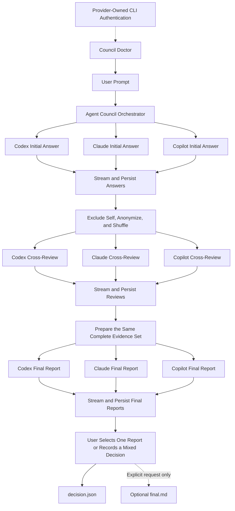

# Agent Council Product Design

## Purpose

Agent Council is a cross-platform terminal application for comparing independent research from Codex CLI, Claude Code, and GitHub Copilot CLI.

The product accepts a user prompt once and coordinates three equal providers through three reasoning stages:

1. three independent initial answers;
2. three anonymous cross-reviews; and
3. three revised final reports.

Agent Council itself performs deterministic coordination only. It does not act as a fourth model, synthesize an authoritative answer, rank the providers, or select a winner. The user chooses one final report or records a mixed decision.

This document describes the intended product behavior and user experience. The non-negotiable requirements in the repository root [`AGENTS.md`](../AGENTS.md) are authoritative if the documents ever conflict.

## Terminal Experience

The default interface is one terminal containing three independently updating provider panels. The same layout is reused for the Initial Answer, Cross-Review, and Final Report stages.

```text
Stage 1 of 3: Initial Answer                                      00:12:48

┌──────────── Codex ────────────┐ ┌──────────── Claude ───────────┐ ┌─────────── Copilot ──────────┐
│ Running                       │ │ Running                       │ │ Completed                    │
│                               │ │                               │ │                              │
│ Inspecting the evidence and   │ │ Comparing the documented     │ │ The primary constraint is... │
│ checking unresolved facts...  │ │ behavior with the source...  │ │                              │
│                               │ │                               │ │                              │
└───────────────────────────────┘ └───────────────────────────────┘ └──────────────────────────────┘

Output is streaming live and being saved. Press Ctrl+C to cancel gracefully.
```

The drawing communicates the product experience, not fixed terminal dimensions. Implementations must preserve these behaviors:

- All three providers start concurrently at each reasoning stage.
- Each provider has a distinct panel with its identity, status, and current output.
- A provider that completes early remains visible while the other providers continue.
- One provider failing must not stop or erase the work of the others.
- Initial Answer, Cross-Review, and Final Report use the same three-provider presentation model.
- On narrow terminals, panels may stack vertically or become selectable tabs, but execution remains three-way and concurrent.
- The UI renders normalized events; it must not own orchestration or persistence logic.
- Output shown in the terminal is saved at the same time. There is no display-only execution mode in the normal workflow.

Suggested provider statuses are `Waiting`, `Running`, `Completed`, `Failed`, and `Cancelled`. The stage header should show the current stage, elapsed run time, and enough session/run identity to find the saved artifacts.

## End-to-End Workflow



Authentication belongs to each provider. Users normally authenticate with all three official CLIs before starting a Council run. `council doctor` verifies installation and authentication before fan-out and reports provider-specific remediation without handling credentials itself.

## Stage Contracts

Each stage is a concurrent fan-out followed by a barrier. The barrier waits until all three provider processes have reached a terminal state: completed, failed, or cancelled. There is no default per-provider timeout.

| Stage          | Input to each provider                                                                                                                 | Required behavior                                                                                                                                         | Persisted output        |
| -------------- | -------------------------------------------------------------------------------------------------------------------------------------- | --------------------------------------------------------------------------------------------------------------------------------------------------------- | ----------------------- |
| Initial Answer | The same original user prompt, preserved verbatim                                                                                      | Independently investigate and answer without seeing the other providers' work                                                                             | `answers/<provider>.md` |
| Cross-Review   | The original prompt and only the other two available initial answers, anonymously labeled and independently shuffled for that reviewer | Evaluate correctness, evidence, omissions, risks, and disagreements without reviewing its own answer                                                      | `reviews/<provider>.md` |
| Final Report   | The same complete evidence set: original prompt, all available initial answers, and all available cross-reviews                        | Revise its conclusion, accept or reject feedback explicitly, identify consensus and disagreement, state unresolved risks, and make a final recommendation | `finals/<provider>.md`  |

All three providers receive equivalent protocol instructions for a given stage. Provider-specific command syntax, event parsing, authentication probes, resume flags, and permission flags stay inside provider adapters.

### Initial Answer

- The user enters the prompt once at the Council level.
- Council stores the prompt verbatim in `prompt.md`.
- Council sends that same user-authored prompt to all three provider sessions concurrently.
- Council-authored protocol instructions may define the output contract, but must be clearly delimited from the user's content.
- Council must not silently specialize, shorten, or rewrite the prompt for individual providers.

### Anonymous Cross-Review

Each reviewer receives exactly the other two available answers. It never receives its own answer inside the review payload.

Anonymous labels are private to a reviewer. For example, Codex may see Claude as `Answer A` and Copilot as `Answer B`, while Claude may see Copilot as `Answer A` and Codex as `Answer B`. Council independently randomizes both the labels and the order for every reviewer.

Council persists the private reviewer-specific mapping for reproducibility and debugging, but never includes provider identities or that mapping in the review prompt or user-facing review prose.

### Final Report

Final Report is a third three-way reasoning stage, not a Council summary step. Each provider works in its existing provider session and receives the same complete evidence set.

Every final report must include:

- a revised conclusion;
- review feedback it accepted and rejected, with reasons;
- areas of consensus and material disagreement;
- unresolved facts, assumptions, and risks; and
- its final recommendation.

The normal result is always three peer final reports. Council must not automatically merge them, score them, name a chair, or describe one as authoritative.

## User Decision

After all available final reports are displayed and saved, the UI lets the user either select one provider report or record a mixed decision. The choice is stored as data in `decision.json`.

Example single selection:

```json
{
  "selectedAgent": "claude",
  "decision": "Use the Claude final report",
  "sources": ["finals/claude.md"]
}
```

Example mixed decision:

```json
{
  "selectedAgent": null,
  "decision": "Use Claude's architecture with Codex's test plan",
  "sources": ["finals/claude.md", "finals/codex.md"]
}
```

A single `final.md` is absent by default. It may be created only after the user explicitly selects a report to copy/reference or explicitly asks one named provider to merge selected material. Council itself never authors the merged prose.

## Live Output and Persistence

The terminal UI and saved artifacts are two projections of the same normalized event stream:

1. A provider adapter converts provider-specific stdout, stderr, JSON, or JSONL into validated Council events.
2. The orchestrator attaches Council session, run, stage, provider, sequence, and timestamp metadata.
3. The event is appended to `events.jsonl` as it occurs.
4. Prose deltas are appended to the provider's current `*.md.partial` artifact.
5. The terminal projection updates the matching provider panel from that event.
6. On successful stage completion, the partial Markdown file is atomically promoted to its final `.md` name.

No provider output should need to be held entirely in memory before it becomes visible or durable. Raw diagnostics may be retained separately when necessary, but secrets and credential-related data must be redacted before persistence or display.

## Sessions, Runs, and Artifacts

A Council Session is a durable multi-turn conversation. A Council Run is one prompt/answer/review/final cycle within that session. A timestamp may identify a run, but must not be the only identity of a Council Session.

```text
.council/
`- sessions/
   `- <stable-session-id>/
      |- session.json
      `- runs/
         `- <run-id>/
            |- prompt.md
            |- run.json
            |- events.jsonl
            |- answers/
            |  |- codex.md
            |  |- claude.md
            |  `- copilot.md
            |- reviews/
            |  |- codex.md
            |  |- claude.md
            |  `- copilot.md
            |- finals/
            |  |- codex.md
            |  |- claude.md
            |  `- copilot.md
            `- decision.json
```

During execution, the current prose artifact uses the `.md.partial` suffix. Completed artifacts from other providers or earlier stages remain untouched if a provider fails or the process is interrupted.

Each Council Session maps to one resumable session for each enabled provider. `council resume <session-id-or-name>` restores the Council Session as a unit; the next prompt fans out to all three resumed provider sessions. Provider-specific resume is not the normal user workflow.

## Failure and Cancellation Experience

- A provider failure never causes automatic cancellation of the other providers.
- If a stage ends without all three required artifacts, Council displays which outputs are complete, failed, or partial and lets the user retry the missing providers or explicitly continue with the available evidence.
- Council never invents a missing answer, assigns another provider to impersonate the failed one, or silently treats a partial file as complete.
- The first `Ctrl+C` requests graceful cancellation for every running child, stops stage progression, and flushes events and partial artifacts.
- The second `Ctrl+C` force-terminates remaining process trees and still attempts a final metadata flush.
- Process-tree termination may differ by platform, but the visible semantics and preservation guarantees must remain consistent on Windows, macOS, and Linux.

## Configuration Experience

Permission bypass is explicit and independent per provider. Safe/approval mode is the default for all providers.

```yaml
agents:
  codex:
    enabled: true
    yolo: false
  claude:
    enabled: true
    yolo: false
  copilot:
    enabled: true
    yolo: false

execution:
  timeout: null
  cancelOnAgentFailure: false
```

`timeout: null` means Council imposes no duration limit. An optional whole-run duration limit may be added later, but there is no default timeout and no implicit per-provider timeout. Provider-specific YOLO flags are translated only inside adapters and never broaden permissions for another provider.

## MVP Boundary

The MVP ends after the user records a selected or mixed decision. It includes provider diagnostics, Council session creation/resume, the three reasoning stages, live streaming, durable artifacts, cancellation, partial-run recovery, and the user decision.

Automatic code implementation, multi-worktree execution, a desktop application, cloud sync, hosted accounts, hidden provider scoring, and Council-authored synthesis are outside the MVP unless the user explicitly changes the scope.
